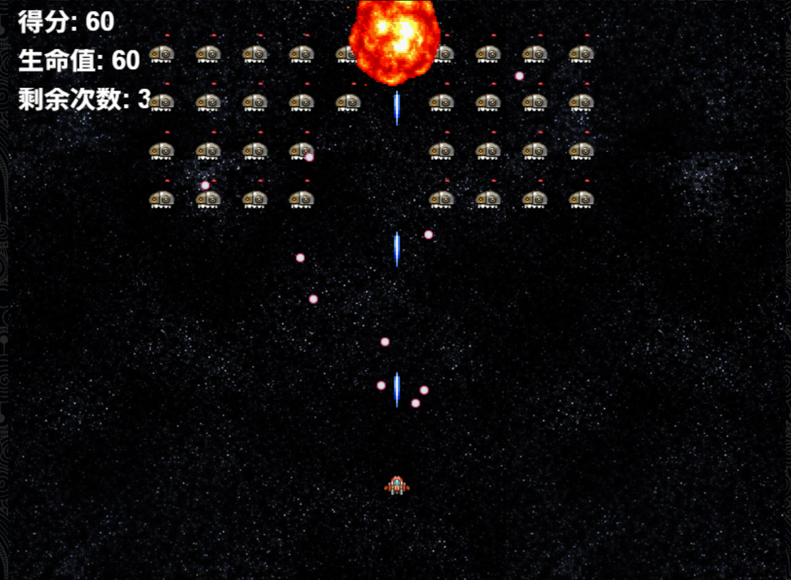

SpaceInvaders 太空侵略者
=============
This is a remake of the space invader phaser example, which you can find here:
http://examples.phaser.io/  
这是对 Phaser 示例中“Space Invader”游戏的一次重制，你可以在以下链接找到原版示例：http://examples.phaser.io/


This remake is made with require.js, which breaks up the code into modules.  
这次重制使用了 require.js，它将代码拆分为多个模块。  
Modules are in assets/javascript/module  
模块文件位于：assets/javascript/module

Code is more organized thanks to State and Statemanager class from Phaser.  
由于使用了 Phaser 提供的 State 和 StateManager 类，代码结构更加清晰。  
You can find the states in assets/javascript/state  
你可以在这里找到各个状态：assets/javascript/state

I used Phaser 2.0.1(no Physics) from the Dev branch.  
我使用的是 Phaser 2.0.1 版本（不包含物理引擎），来源于 Dev 分支。
The dev branch has a lot of bug fixes so it's recommended to use it.  
Dev 分支包含大量 bug 修复，因此推荐使用这个分支。

Thanks to require.js, i made an optimized version of my game,  
多亏了 require.js，我还制作了一个优化版本的游戏，  
which can be viewed with indexOpt.html. This use the "compiled" code, which can be found in assets/javascript/built  
你可以在 indexOpt.html 中查看。该版本使用“编译后”的代码，你可以在 assets/javascript/built 中找到相关文件。

Known issue: In every new play state(after the end state) the game makes new DOM nodes.  
已知问题：每次进入新的游戏状态（比如在“游戏结束”之后重新开始），游戏都会创建新的 DOM 节点。  
The cause: in every cycle i make a new text to show the score.  
原因：每个循环中我都会新建一个文本对象用于显示分数。  
I tried to destroy the texts but i never succeed.  
我尝试过销毁这些文本对象，但从未成功。

You can play with it here: http://strykerkkd.github.io/SpaceInvaders/  
你可以在这里试玩：http://strykerkkd.github.io/SpaceInvaders/

## 部署说明

当前汉化仅适用于 版本：

首先感谢原作者的开源。[原项目地址](https://github.com/StrykerKKD/SpaceInvaders)

具体汉化了那些内容，请参考[翻译说明](./翻译说明.md)。

只做了汉化和简单修改，有问题，请到原作者仓库处反馈。

有需要帮忙部署这个项目的朋友,一杯奶茶,即可程远程帮你部署，需要可联系。  
微信号 `E-0_0-`  
闲鱼搜索用户 `明月人间`  
或者邮箱 `firfe163@163.com`  
如果这个项目有帮到你。欢迎start。

有其他的项目的汉化需求，欢迎提issue。或其他方式联系通知。

### 镜像

从阿里云或华为云镜像仓库拉取镜像，注意填写镜像标签，镜像仓库中没有`latest`标签

容器内部端口 3000

```bash
docker pull swr.cn-north-4.myhuaweicloud.com/firfe/space_invaders:2025.05.05
```

### docker run 命令部署

```bash
docker run -d \
--name space_invaders \
--network bridge \
--restart always \
--log-opt max-size=1m \
--log-opt max-file=3 \
-p 3000:3000 \
swr.cn-north-4.myhuaweicloud.com/firfe/space_invaders:2025.05.05
```
### compose 文件部署 👍推荐

```yaml
#version: '3.9'
services:
  space_invaders:
    container_name: space_invaders
    image: swr.cn-north-4.myhuaweicloud.com/firfe/space_invaders:2025.05.05
    network_mode: bridge
    restart: always
    logging:
      options:
        max-size: 1m
        max-file: '3'
    ports:
      - 3000:3000
```

## 修改说明

这里对除了汉化之外的代码修改的说明。  
增加修改部分具体见 [修改说明](./修改说明.md)。

`./README.md` 文件翻译，增加 `## 部署说明`、`## 修改说明`、`## 效果截图` 部分。

增加目录 `./图片`
新增文件 `./.dockerignore`、`./Dockerfile`、`./翻译说明.md`、`./修改说明.md`

## 效果截图



